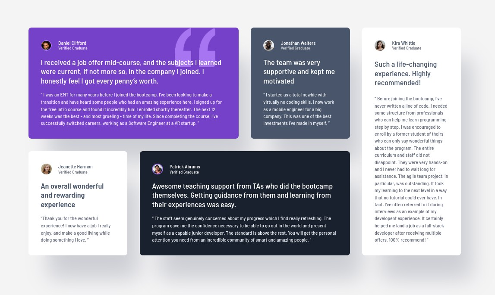

# Frontend Mentor - Testimonials grid section solution

This is a solution to the [Testimonials grid section challenge on Frontend Mentor](https://www.frontendmentor.io/challenges/testimonials-grid-section-Nnw6J7Un7). Frontend Mentor challenges help you improve your coding skills by building realistic projects.

## Table of contents

- [Overview](#overview)
  - [The challenge](#the-challenge)
  - [Screenshot](#screenshot)
  - [Links](#links)
  - [Built with](#built-with)
  - [What I learned](#what-i-learned)
  - [Useful resources](#useful-resources)
- [Author](#author)

## Overview

Solution of Testimonials Grid Section challenge, using Vanilla CSS

### The challenge

Users should be able to:

- View the optimal layout for the site depending on their device's screen size

### Screenshot

### Links

- Solution URL: [Code](https://github.com/mci3x/Testimonials-Grid-Section)
- Live Site URL: [Live site](https://mci3x.github.io/Testimonials-Grid-Section/)

### Built with

- Semantic HTML5 markup
- CSS custom properties
- Flexbox
- CSS Grid
- Mobile-first workflow

### What I learned

- Good Flexbox and Grid practice

### Useful resources

- [MDN](https://developer.mozilla.org/)
- [web.dev](https://web.dev/)
- [CSS Tricks](https://css-tricks.com/)

## Author

- GitHub - [mci3x](https://github.com/mci3x)
- Frontend Mentor - [@mci3x](https://www.frontendmentor.io/profile/mci3x)
- Bluesky - [@mci3x.bsky.social](https://bsky.app/profile/mci3x.bsky.social)
- X - [@mci3x](https://www.x.com/mci3x)
- Linkedin - [mci3x](https://www.linkedin.com/in/mci3x/)
